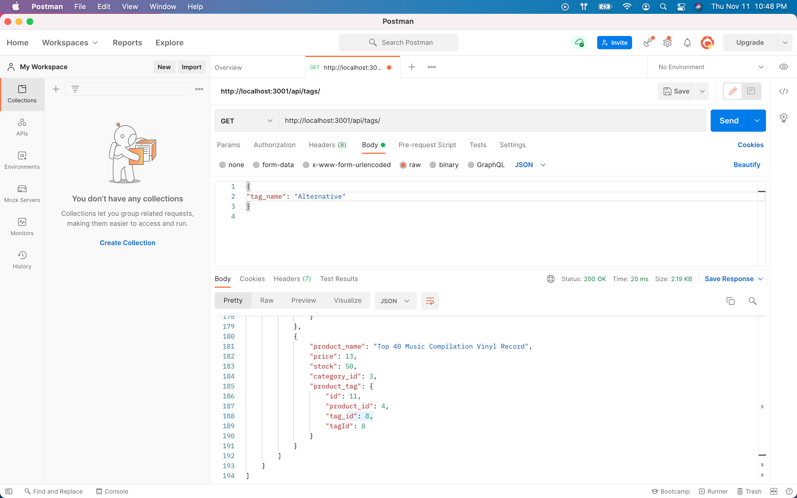

# E-Commerce Back End

## Project Description

This application is the back end for an e-commerce site by modifying starter code. This application configures a working Express.js API to use Sequelize to interact with a MySQL database.

## User Story

```md
AS A manager at an internet retail company
I WANT a back end for my e-commerce website that uses the latest technologies
SO THAT my company can compete with other e-commerce companies
```

## Screenshot

The following image shows the Team Profile Generator application's appearance and functionality:



walkthrough video link that demonstrates applications functionality: 
<https://watch.screencastify.com/v/CSPq9zfblvLXwA1wTLlc>


The URL of the GitHub repository is: 
<https://github.com/ArshleenKNagpal/E-Commerce-Back-End>

---
© 2021 Trilogy Education Services, LLC, a 2U, Inc. brand. Confidential and Proprietary. All Rights Reserved.